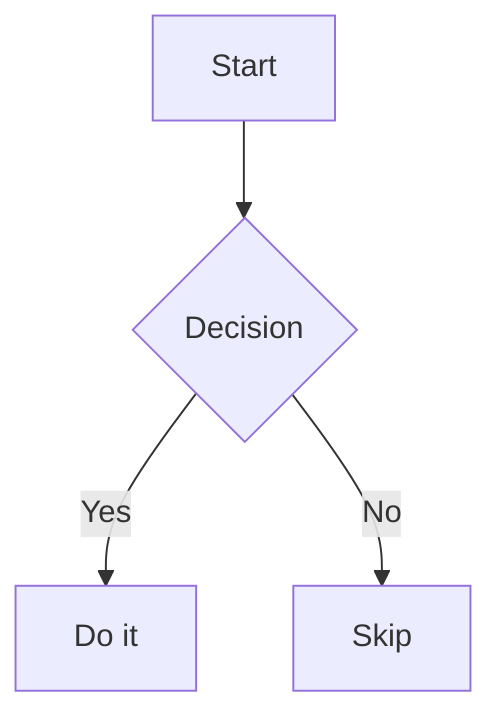
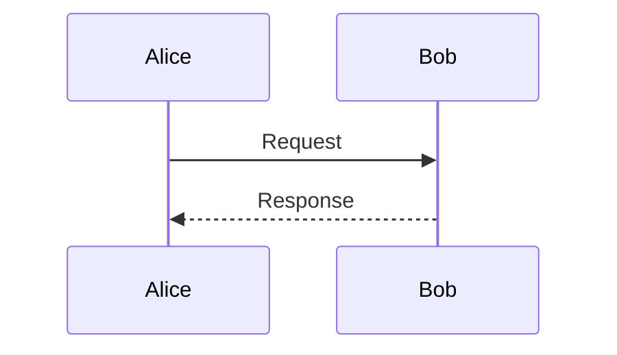

# Create and Update Mermaid Diagram Artifacts

Use this skill when the user asks for a diagram, flowchart, sequence diagram, class/UML diagram, state machine, ER diagram, Gantt chart, mindmap, or git graph — anything expressed as a Mermaid text definition.

## MCP workflow

The configured MCP server is `mermaid`. Start by discovering its current tools:

```json
{"server": "mermaid"}
```

Use `call_mcp_tool` with these tools:

- `create_diagram` — create a stateful diagram and return an HTML artifact. Pass an explicit `definition`.
- `update_diagram` — update an existing `diagram_id` (replace the definition, change title, theme, or height).
- `list_diagrams` — inspect diagrams currently held by the stateful MCP subprocess.

The server is stateful, so keep and reuse the returned `diagram_id` when the user asks to modify a diagram. If a new turn lacks a known `diagram_id`, call `list_diagrams` before creating a duplicate.

## Definition shape

Mermaid renders the diagram from its text definition; you only write the definition. The first line declares the diagram type. Examples include the following:





Supported types include `graph`/`flowchart`, `sequenceDiagram`, `classDiagram`, `stateDiagram-v2`, `erDiagram`, `gantt`, `journey`, `pie`, `mindmap`, and `gitGraph`. Use the Mermaid syntax for the type you need; do not hand-author SVG.

`theme` may be one of `default`, `neutral`, `dark`, `forest`, or `base`.

If a definition has a syntax error, the diagram fails to render and the parser error comes back to you as a structured `widget_event` with `event: "render_error"` and `data.message`. Read it, fix the definition, and call `update_diagram`. Large diagrams are not clipped — the artifact has built-in pan and zoom controls.

## Artifact updates

The diagram tools use the harness-wide artifact update contract:

- `artifact_update_mode: "append"` renders a separate new artifact.
- `artifact_update_mode: "replace"` or `"update"` refreshes an existing artifact.
- `artifact_update_mode: "upsert"` refreshes the target when present, otherwise renders a new artifact.
- `artifact_target_id` selects the artifact to refresh; it defaults to the `diagram_id` for `update_diagram`.

When the user asks to modify an existing diagram, call `update_diagram` with the same `diagram_id` and the default replacement behavior. Use `append` only when the user asks to compare diagrams or keep both versions visible.
