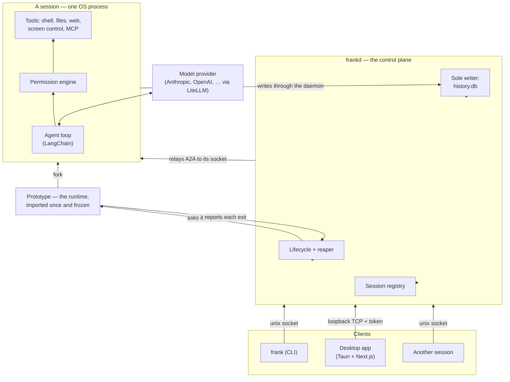

# Architecture

## The words this uses

Six terms carry most of the meaning here, and four of them are Frank's own.

| Term | What it means |
|---|---|
| **Session** | One conversation with an agent. It is a durable record, and it has an OS process only while it is working. |
| **Turn** | One exchange within a session: a message in, the model's work, and everything it said and did before it stopped. A session has many turns over its life. |
| **Harness** | The code between the model and your machine — the turn loop, the tools, the prompts, the permissions. `frank.Session` is the harness, and everything else here is built on it. |
| **Control plane** | The daemon's API. Every client reaches a session through it, so a caller is identified and scoped in exactly one place. |
| **Location** | Where a session's tools actually run: this machine, or an SSH host. Distinct from its working directory, which is *where* on that location. |
| **Peer** | A session created by another session. Not a special kind of thing — an ordinary session, addressed the way you address any session. |

[A2A](https://github.com/google/A2A) is Agent-to-Agent, Google's JSON-RPC protocol for one agent to call another. Each session serves it on its own socket, so a peer and a person reach a session the same way.

## The four layers

Each layer uses the one below it and adds a single thing.

| Layer | What it adds | What it knows about your machine |
|---|---|---|
| `frank.Session` | The harness: the turn loop, the tools, the prompts, the permissions | Nothing. Every value is one you passed |
| `frank.daemon.machine` | Turns a home directory into what the harness takes | The XDG paths, and your `.agents` |
| `frankd` | A process per session, a socket each, and the databases | Everything, and it is the right place to |
| `frank`, and the app | A way for a person to reach the daemon | Where the daemon is |

The bottom layer is the whole of the harness. A program can embed it and never start a daemon; see [As a library](library.md). Everything below in this document is what the three layers above add.

Frank is one executable entered four ways. `frank` is the command a person runs and `frankd` is the daemon. `prototype` is the process the daemon forks sessions from, and `session` is one session worker.

They are the same image, not four binaries, for two reasons. Packaging stays a single specification. A worker launched as a re-exec also carries the same code identity as the signed application bundle. One macOS Accessibility grant therefore covers every session, instead of prompting once per worker.

## Sessions

A **session** is a durable record, with an OS process only while it is working. The harness creates it empty, then drives it by messages over its life. Creation and work are separate steps. You can therefore send the same session a second task, attach to it, and inspect it between them.

The process is an activity, not the session. An idle session sleeps immediately: its worker stops, and its record and its conversation stay. The next message forks it a new worker from the prototype, in about 60 ms.

There is deliberately no linger window. At that price, a 12 MB interpreter held alive for a message that may not come pays continuously to avoid paying occasionally. A session parked on a permission prompt is the clearest case. The suspension is already fully on disk. To hold an interpreter for a person who may take hours bought nothing.

Two consequences follow. A daemon restart ends every session's *process* and no session at all. The harness derives the capability token from the session id; it does not store it. A woken session must get the same token that its creator got.

Each session serves [A2A](https://github.com/google/A2A) (JSON-RPC) on **its own unix socket** in the runtime directory, and the daemon is what talks to it. Every client reaches the daemon, and the daemon relays: the terminal, the desktop app, another session. There is therefore one place that identifies a caller, scopes it to its own subtree, and records it. A session's socket being real and addressable is what makes that relay a thin hop rather than a reimplementation, but nothing bypasses it today.

There is no in-process delegation: a session that needs a peer creates an ordinary session and messages it. See [Tools](tools.md#composing-with-other-sessions). A child appears in `frank ps`, can be attached to, and is reaped when its parent ends.

Isolation is a property of the process. A process becomes one session and stays that session for the rest of its life.

Nothing reuses it, and it never serves a second session. No path exists by which one session's state reaches another's. That holds under forking too. A fork copies the prototype, which ran no agent and holds no session state. A fork never copies another session.

## The daemon

`frankd` is deliberately thin — it runs no agents, and it never imports the runtime. It owns:

- the **registry** of sessions (identity, parent, permission mode, status);
- the **lifecycle**: asking the prototype to fork a session, hearing about crashes, and reaping a subtree parent-last so a child never outlives its parent;
- the **databases**, as the sole writer — workers persist by posting to the daemon's ingest surface, so there is exactly one process writing SQLite;
- the shared **brokers**: events, terminals, file leases, workspaces, signed file URLs, push notifications, and remote agents — everything there can only sensibly be one of;
- the **prototype**, which it starts, supervises and restarts. It is a separate process, not a part of the daemon, for a reason the layering makes unavoidable. Whatever forks a session must already have imported the runtime. The daemon must never import the runtime. If the prototype dies, live sessions are untouched — they are independent processes — and only new sessions wait, for as long as the restart takes.

It serves one API two ways:

- A **unix socket**, for the CLI and for sessions.
- A **loopback TCP port**, for the desktop client, which cannot open a unix socket from a webview. The port is ephemeral and chosen at boot; both listeners require the capability token the daemon writes `0600` into the runtime directory.

A token says a caller may drive the daemon; it does not say *who* is calling, and on the unix socket that distinction is load-bearing. A session's own `bash` tool runs as the same user, and it can read that `0600` file. Attribution on tokens alone would therefore let a session present the daemon's token. It would then get a peer with no parent and no permission clamp.

The unix listener asks the kernel instead. `SO_PEERCRED` on Linux, or `LOCAL_PEERPID` on macOS, names the process that opened the connection. Every worker starts as a process-session leader, so `getsid` on that pid names the session it belongs to. That covers the worker itself, and every shell command and `frank` invocation underneath it.

That answer wins over the token. A session is therefore itself, whatever token it holds. A caller that the kernel places in no session stays unattributed, as it should: a person's terminal, or the desktop client. `frank kill` signals that same session id.

The two answers are one fact, read in two directions. What the kernel calls a session is what the harness attributes to it, and what it reaps with it. A caller can `setsid` itself, which leaves the session entirely. It stops being the session; it does not escape as the session. It is then no longer identified, no longer scoped, and no longer reaped.

## The CLI

`frank` adds nothing the control plane does not have — it is the ergonomic face of it. `create` a session and `send` it work. `ps` what runs, `attach` to watch, and `tree` to see what created what. `approve` a pending tool call, and `kill` a subtree. `remote` reaches an agent on another host, and `configure` sets what the next session starts with. The [CLI guide](cli.md) is the reference.

Everything goes to the daemon, `send` included — `frank` opens the daemon's unix socket and posts to `/rpc`, and the daemon relays to the owning session. One path, so a call is attributed and scoped in exactly one place whoever made it.

## The app

A [Tauri](https://tauri.app) shell around a [Next.js](https://nextjs.org) UI (static export; Chakra UI). It is a **client** — it holds no agent logic. It renders conversations, manages settings, and chooses which daemon to talk to.

It also holds no state of its own. Which workspace you were last in, the colour mode, the locale: all of it is the daemon's, read at startup and written back on change. Two windows onto one daemon therefore agree, and a client that has never run before opens on what the daemon already knows rather than on defaults.

Because a webview cannot open a unix socket, the app uses the daemon's loopback listener and the daemon relays data-plane commands to the owning session.

The app does not contain a daemon and does not start one. It finds one by reading the port and token that `frankd` publishes into the runtime directory. When there is none it is powerless, exactly as it is when a remote host does not answer.

"Local" labels the daemon on this machine; it is not a different mechanism. To connect to it is the same act as connecting over a tunnel, without the tunnel. The daemon is a separate installable (`packaging/build-daemon.sh`), signed with the same identity as the app so the two share one macOS Accessibility grant. `frank app` brings the daemon up and launches the window in one command. The dependency therefore runs from the command line to the app, not the other way round.

## Connections: local, remote, SSH

A daemon's address and its token belong together. Each `frankd` mints its own token at boot, so a remote daemon does not accept the local one. A saved connection profile therefore carries both. The client resolves, in order:

1. a connection you activated in **Settings**, under **Connections** (its URL and its token), then
2. the endpoint the desktop shell reports for the local daemon, then
3. the build-time default `NEXT_PUBLIC_FRANK_API_BASE`, then
4. the conventional local address.

That yields three ways to run:

- **Local (default).** The app reads the port and token that `frankd` published into the runtime directory. It does not start it; `frank app` does, before it opens the window.
- **Remote URL.** Run `frankd` on another host, expose its loopback port behind your own transport security, and add the URL plus the token. The app becomes a native front-end to a remote backend — the agent's shell, files, and network all live on that host.
- **Over SSH.** Add an SSH host. Frank forwards a local port to the daemon's port on the remote machine. The harness can therefore live on a machine you reach only over SSH, with nothing exposed.

For the last two, run `frank daemon endpoint` on that host: it reports the port and the token the connection needs.

Keeping the halves apart serves one goal: **put the compute, the files, and the credentials wherever they belong, and keep the interface native and local.**

## What a session has, and what it may reach

Two questions that look alike and are not. **May reach** is the confinement, above: an operating-system boundary around every tool child. **Has** is the session's toolbox — a package profile of its own on `PATH`, which it installs into itself.

Keeping them apart is the point. When one answer served both, a missing tool arrived as `Operation not permitted`, indistinguishable from a refused path, and an agent that cannot tell those apart treats the first as something to route around. With a toolbox, obtaining a tool always has an ordinary ending, so every refusal that remains is a real one — which makes the boundary sharper rather than weaker, and makes the log easier to read: "it tried to leave the workspace" is no longer buried under "it did not have `jq`".

The toolbox is per session and dies with it. Packages come out of the shared read-only store; the session owns only symlinks.

## Permissions

A session's permission mode is chosen when the session is created and can be changed while it runs — the change reaches the turn already in flight. A child gets a mode no looser than its parent's, and tightening a session tightens everything it created. There is no bypass mode and no standing "always allow"; the only runtime decisions are allow-once and deny. See [Security notes](../SECURITY.md).

## Request lifecycle (a message)

1. You send a message to a session. Every client posts to the daemon, which relays it to the session that owns it. A session mid-turn takes the message *into* that turn at its next safe point; one parked on a decision takes nothing and says so, because starting a turn would discard the parked one.
2. The agent loop calls the model, which may request tool calls.
3. Each tool call is classified for risk and checked against the session's permission mode. If it needs approval, the session streams a permission request; the CLI prints it and `frank allow` or `frank deny` answers, or the app shows an overlay.
4. Approved tools then run:
- **Shell**, inside an OS-enforced confinement: `sandbox-exec` on macOS, Landlock on Linux. The harness resolves it when the session is created, and clamps it against the creator.
- **Files**, on the active location.
- **Screen control** (`control_screen`), against the local machine.
- **MCP**, against the session's own connections. Stateful connections and stdio subprocesses do not cross a process boundary, so a session connects its own rather than sharing the daemon's.
5. Results stream back as structured events. The session posts them to the daemon, which is the only writer of `history.db`, and fans them out to whoever is attached.
6. The turn ends when the model stops asking for tools — unless the session holds a **goal**, in which case the session opens itself another turn and carries on. See below.

## Goals

A turn ends when the model stops talking. That is the wrong unit for work that was asked for as an outcome, because the model can stop for reasons that have nothing to do with the outcome being real.

So a session can hold one **goal**: the end state in a sentence, plus the conditions that must hold for it to be true, both written by the agent through `update_goal` and both durable beside the conversation. While a goal is open, the end of a turn is not the end of the work — the session opens itself another turn, with the goal restated, until the agent satisfies it (naming the evidence for each condition), clears it, or reports it blocked.

Two bounds keep that from being an unattended machine that never stops. `Tunable.goal_continuation_turns` is how many turns a session may open in a row with nobody watching; reaching it *parks* the goal, which is neither abandoning it nor calling it stuck — the session simply waits, and anything anyone says gives the allowance back and picks the goal up where it stopped. And the goal itself is visible in the app above the composer, with a control that calls it off outright.

What opens those turns is the layer that owns the session, never the model: the agent is shown the goal and the conditions, and nothing about the counting behind it.

## Prompt caching, and what is recorded about it

Every provider here bills a cached prefix at a fraction of a fresh one, and a conversation is almost entirely prefix: the system prompt, the tool schemas, and every turn that came before. So a session's cost is decided less by what it does than by whether the request it sends still matches the one before it. Two rules follow, and the harness holds both.

**The request is append-only, without exception.** Each call adds to the end and rewrites nothing. The instructions and the tool schemas are stable for the life of a session. The observation log a fold produces is a user-role message rather than a system one — a mid-conversation system message is hoisted to the front of the request by every provider, so rewriting it would discard the cache for the whole conversation each time compaction ran to save context. And everything the model is told about the current turn is a message *in* the conversation, kept, rather than something assembled for one request.

That last one was learned from the measurement below. Per-turn context — the time, the working directory, the goal, the task list, background work, the reachable locations — used to be appended to the request and dropped afterwards, on the reasoning that a stale timestamp should not accumulate. It was the only thing in the harness that was not append-only, and it showed up as a divergence on five of twelve calls in the first session that was measured, always at the final position. It is appended and kept now, and emitted only when it says something new: of those fields only the clock moves every turn, and a fresh clock reading does not earn a message of its own. A session doing steady work therefore appends nothing, and one whose situation changed appends the picture once.

The only thing that ever invalidates a prefix is compaction, which replaces the head of the conversation with a summary. That is the point of it, and it is why provider-native reasoning is dropped at the same boundary.

**The cache is asked for by name.** A provider does not keep one global store; it routes a lookup by hashing the head of the prefix *together with* a key, so requests that share a key land where their prefix is. Every provider is sent `prompt_cache_key` set to the session id — one session is one conversation is one prefix. Claude additionally gets explicit `cache_control` breakpoints, two at the front over the tools and prompt and two at the moving end, since Anthropic caches nothing unless asked.

That still leaves the question a bill cannot answer. A provider serves the longest prefix it recognises, so a low cache read is either a request that stopped matching — in which case something here moved it — or one that matched and was not served, which nothing here can fix. Those want opposite responses and look identical from the outside.

So every model call records how it compared to the one before it. The request is cut into the segments the wire is built from — the instructions, the tool schemas, then one per conversation item — and each is digested and counted; the next call's segments are compared against them. `frank.runtime.cache_trace` does the measuring and both model adapters carry it.

| Recorded on each `token_usage` event | What it says |
|---|---|
| `timestamp` | When the call happened, ISO-8601 UTC. Every streamed event carries one — the transcript's order says what came next, never how long after, and a prompt cache goes cold with time |
| `input_tokens`, `output_tokens` | The call's own size, not a running total |
| `cache_read_tokens`, `reasoning_tokens` | The call's own cache read and reasoning spend |
| `prefix_intact` | Whether every segment shared with the previous call was unchanged |
| `reachable_tokens` | Tokens of unchanged prefix — the ceiling `cache_read_tokens` is measured against. An estimate: counted with this harness's tokenizer, not the provider's |
| `segments`, `shared_segments` | The same comparison in pieces rather than tokens |
| `divergence` | When the prefix moved: `index`, the segment `current` and `previous` (each a `kind`, `position` and `role`), and `rewritten` — the piece stayed in place and its contents changed |
| `cumulative` | Session-lifetime totals, as before |

Recorded rather than logged, because the question is asked days later of a particular call in a particular session, and only stored data answers that. The events live in `history.db` beside the transcript and replay with it, so a past session can be audited as readily as a running one.

Reading them together is what makes a diagnosis. `prefix_intact` true with `cache_read_tokens` at zero means the provider was handed bytes it had already been sent and returned nothing for them — routing, not the request, and no differently shaped request would help. A `divergence` with `rewritten` true is the opposite: something here rewrote a message in place, and the `position` and `role` say which.

Two caveats when querying. The first call of a session has nothing to compare against and always reports `prefix_intact` false, as does the first call after a worker restart, since the comparison lives on the model object; filter on `shared_segments > 0` to exclude them. And `reachable_tokens` can exceed `input_tokens` by a few percent, because the two are counted with different tokenizers — a *large* disagreement is itself worth looking at.

## Where to go next

- Configure providers and behavior: [Configuration guide](configuration.md).
- Author agents, skills, memory, and MCP servers: [Agents and skills guide](agents-and-skills.md).
- The tool surface in detail: [Tools guide](tools.md).
