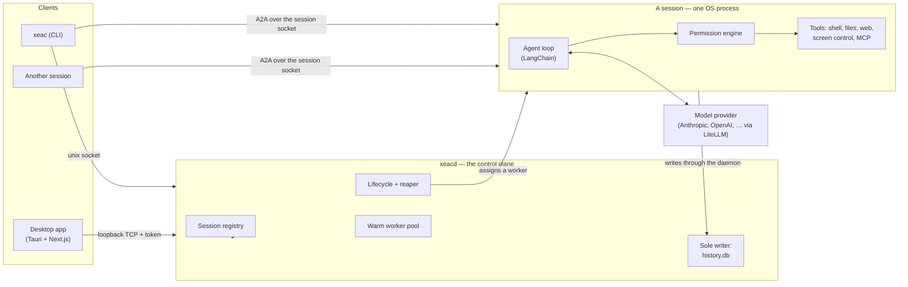

# Architecture

XEAC is one executable entered three ways. `xeac` is the command a person runs, `xeacd` is the daemon, and a **worker** is what the daemon re-execs to become a session. They are the same image rather than three binaries for two reasons: packaging stays a single specification, and a worker launched as a re-exec carries the same code identity as the signed application bundle — which is what keeps one macOS Accessibility grant covering every session instead of prompting once per worker.

## Sessions

A **session** is one OS process running one agent. It is created empty and then driven by messages over its life — creation and work are separate steps, so the same session can be sent a second task, attached to, and inspected between them.

Each session serves [A2A](https://github.com/google/A2A) (JSON-RPC) on **its own unix socket** in the runtime directory. Anything holding that address can talk to it: you from the terminal, the desktop app, or another session. There is no in-process delegation — a session that needs a peer creates one through the same control plane a person's client calls, using its `create_session` tool, and the peer answers by messaging it back. A child appears in `xeac ps`, can be attached to, and is reaped when its parent ends.

Isolation is a property of the process. A worker is assigned exactly once and becomes that session for the rest of its life; it is never returned to the pool and never serves a second session, so there is no path by which one session's state can reach another's.

## The daemon

`xeacd` is deliberately thin — it runs no agents, which is what keeps it light enough to pre-fork workers from. It owns:

- the **registry** of sessions (identity, parent, permission mode, capability token, status);
- the **lifecycle**: starting workers, watching for crashes, and reaping a subtree parent-last so a child never outlives its parent;
- the **databases**, as the sole writer — workers persist by posting to the daemon's ingest surface, so there is exactly one process writing SQLite;
- the shared **brokers**: events, terminals, file leases, workspaces, signed file URLs, push notifications, and remote peers — everything there can only sensibly be one of;
- a **warm worker pool** with a floor and a ceiling, so spawning a session is a socket write rather than a Python cold start, and a fan-out of ten children does not serialise behind the floor.

It serves one API two ways: a **unix socket** for the CLI and for sessions, and a **loopback TCP port** for the desktop client, which cannot open a unix socket from a webview. The port is ephemeral and chosen at boot; both listeners require the capability token the daemon writes `0600` into the runtime directory.

## The CLI

`xeac` adds nothing the API does not have — it is the ergonomic face of it. `create` a session, `send` it work, `ps` what is running, `attach` to watch, `tree` to see what spawned what, `approve` a pending tool call, `kill` a subtree, `remote` to reach a peer on another host, `configure` what the next session starts with. The [CLI guide](cli.md) is the reference.

Lifecycle and reads go to the daemon; a data-plane message goes straight to the owning session's socket. Same API, different transport.

## The app

A [Tauri](https://tauri.app) shell around a [Next.js](https://nextjs.org) UI (static export; Chakra UI). It is a **client** — it holds no agent logic. It renders conversations, manages settings, previews artifacts, and chooses which daemon to talk to.

Because a webview cannot open a unix socket, the app uses the daemon's loopback listener and the daemon relays data-plane commands to the owning session. The packaged app bundles a frozen copy of the harness (PyInstaller, via `packaging/build-sidecar.sh`) and starts `xeacd` automatically, so a fresh install works with zero setup.

## Connections: local, remote, SSH

A daemon's address and its token belong together — each `xeacd` mints its own token at boot, so a remote daemon does not accept the local one. A saved connection profile therefore carries both. The client resolves, in order:

1. a connection you activated in **Settings → Connections** (its URL and its token), then
2. the endpoint the desktop shell reports for the local daemon, then
3. the build-time default `NEXT_PUBLIC_XEAC_API_BASE`, then
4. the conventional local address.

That yields three ways to run:

- **Local (default).** The app starts and manages `xeacd` on this machine and reads its token from the runtime directory.
- **Remote URL.** Run `xeacd` on another host, expose its loopback port behind your own transport security, and add the URL plus the token. The app becomes a native front-end to a remote backend — the agent's shell, files, and network all live on that host.
- **Over SSH.** Add an SSH host; XEAC forwards a local port to the daemon's port on the remote, so the harness can live on a machine you only reach over SSH with nothing exposed.

For the last two, run `xeac daemon endpoint` on that host: it reports the port and the token the connection needs.

Keeping the halves apart serves one goal: **put the compute, the files, and the credentials wherever they belong, and keep the interface native and local.**

## Permissions

A session's permission mode is fixed when it is created and cannot be changed afterwards, and a child is clamped to no looser a mode than its parent. There is no bypass mode and no standing "always allow"; the only runtime decisions are allow-once and deny. See [Security notes](../SECURITY.md).

## Request lifecycle (a message)

1. You send a message to a session — `xeac send` writes to its socket directly; the app posts to the daemon, which relays it.
2. The agent loop calls the model, which may request tool calls.
3. Each tool call is classified for risk and checked against the session's permission mode. If it needs approval, the session streams a permission request; the CLI prints it and `xeac approve` answers, or the app shows an overlay.
4. Approved tools run — shell in the sandbox, files on the active location, screen control (`control_screen`) against the local machine, MCP against the session's own connections (stateful connections and stdio subprocesses do not cross a process boundary, so a session connects its own rather than sharing the daemon's).
5. Results stream back as structured events. The session posts them to the daemon, which is the only writer of `history.db`, and fans them out to whoever is attached.

## Where to go next

- Configure providers and behavior: [Configuration guide](configuration.md).
- Author agents, skills, memory, and MCP servers: [Agents and skills guide](agents-and-skills.md).
- The tool surface in detail: [Tools guide](tools.md).
