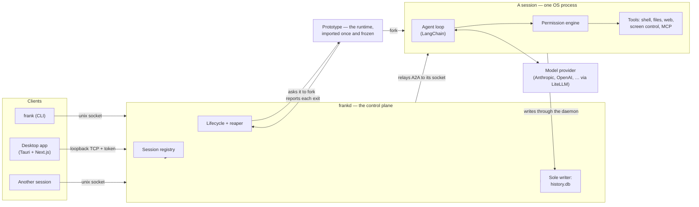

# Architecture

Frank is one executable entered three ways. `frank` is the command a person runs, `frankd` is the daemon, and a **worker** is what the daemon re-execs to become a session. They are the same image, not three binaries, for two reasons. Packaging stays a single specification. A worker launched as a re-exec also carries the same code identity as the signed application bundle. One macOS Accessibility grant therefore covers every session, instead of prompting once per worker.

## Sessions

A **session** is a durable record, with an OS process only while it is working. The harness creates it empty, then drives it by messages over its life. Creation and work are separate steps. You can therefore send the same session a second task, attach to it, and inspect it between them.

The process is an activity, not the session. An idle session sleeps immediately: its worker stops, and its record and its conversation stay. The next message forks it a new worker from the prototype, in about 60 ms.

 There is deliberately no linger window. At that price, a 12 MB interpreter held alive for a message that may not come pays continuously to avoid paying occasionally. 
A session parked on a permission prompt is the clearest case. The suspension is already fully on disk. To hold an interpreter for a person who may take hours bought nothing.

Two consequences follow. A daemon restart ends every session's *process* and no session at all. The harness derives the capability token from the session id; it does not store it. A woken session must get the same token that its creator got.

Each session serves [A2A](https://github.com/google/A2A) (JSON-RPC) on **its own unix socket** in the runtime directory, and the daemon is what talks to it. Every client reaches the daemon, and the daemon relays: the terminal, the desktop app, another session. There is therefore one place that identifies a caller, scopes it to its own subtree, and records it. A session's socket being real and addressable is what makes that relay a thin hop rather than a reimplementation, but nothing bypasses it today.

There is no in-process delegation. A session that needs a peer creates one with its `create_session` tool, through the control plane a person's client calls. The peer answers by messaging it back. A child appears in `frank ps`, can be attached to, and is reaped when its parent ends.

Isolation is a property of the process. A process becomes one session and stays that session for the rest of its life.

Nothing reuses it, and it never serves a second session. No path exists by which one session's state reaches another's. That holds under forking too. A fork copies the prototype, which ran no agent and holds no session state. A fork never copies another session.

## The daemon

`frankd` is deliberately thin — it runs no agents, and it never imports the runtime. It owns:

- the **registry** of sessions (identity, parent, permission mode, capability token, status);
- the **lifecycle**: asking the prototype to fork a session, hearing about crashes, and reaping a subtree parent-last so a child never outlives its parent;
- the **databases**, as the sole writer — workers persist by posting to the daemon's ingest surface, so there is exactly one process writing SQLite;
- the shared **brokers**: events, terminals, file leases, workspaces, signed file URLs, push notifications, and remote agents — everything there can only sensibly be one of;
- the **prototype**, which it starts, supervises and restarts. It is a separate process, not a part of the daemon, for a reason the layering makes unavoidable. Whatever forks a session must already have imported the runtime. The daemon must never import the runtime. If the prototype dies, live sessions are untouched — they are independent processes — and only new sessions wait, for as long as the restart takes.

It serves one API two ways:

- A **unix socket**, for the CLI and for sessions.
- A **loopback TCP port**, for the desktop client, which cannot open a unix socket from a webview. The port is ephemeral and chosen at boot; both listeners require the capability token the daemon writes `0600` into the runtime directory.

A token says a caller may drive the daemon; it does not say *who* is calling, and on the unix socket that distinction is load-bearing. A session's own `bash` tool runs as the same user, and it can read that `0600` file. Attribution on tokens alone would therefore let a session present the daemon's token. It would then get a peer with no parent and no permission clamp.

The unix listener asks the kernel instead. `SO_PEERCRED` on Linux, or `LOCAL_PEERPID` on macOS, names the process that opened the connection. Every worker starts as a process-session leader, so `getsid` on that pid names the session it belongs to. That covers the worker itself, and every shell command and `frank` invocation underneath it.

That answer wins over the token. A session is therefore itself, whatever token it holds. A caller that the kernel places in no session stays unattributed, as it should: a person's terminal, or the desktop client. `frank kill` signals that same session id.

The two answers are one fact, read in two directions. What the kernel calls a session is what the harness attributes to it, and what it reaps with it. A caller can `setsid` itself, which leaves the session entirely. It stops being the session; it does not escape as the session. It is then no longer identified, no longer scoped, and no longer reaped.

## The CLI

`frank` adds nothing the control plane does not have — it is the ergonomic face of it. `create` a session and `send` it work. `ps` what runs, `attach` to watch, and `tree` to see what created what. `approve` a pending tool call, and `kill` a subtree. `remote` reaches an agent on another host, and `configure` sets what the next session starts with. The [CLI guide](cli.md) is the reference.

Everything goes to the daemon, `send` included — `frank` opens the daemon's unix socket and posts to `/rpc`, and the daemon relays to the owning session. One path, so a call is attributed and scoped in exactly one place whoever made it.

## The app

A [Tauri](https://tauri.app) shell around a [Next.js](https://nextjs.org) UI (static export; Chakra UI). It is a **client** — it holds no agent logic. It renders conversations, manages settings, and chooses which daemon to talk to.

Because a webview cannot open a unix socket, the app uses the daemon's loopback listener and the daemon relays data-plane commands to the owning session.

The app does not contain a daemon and does not start one. It finds one by reading the port and token that `frankd` publishes into the runtime directory. When there is none it is powerless, exactly as it is when a remote host does not answer.

"Local" labels the daemon on this machine; it is not a different mechanism. To connect to it is the same act as connecting over a tunnel, without the tunnel. The daemon is a separate installable (`packaging/build-daemon.sh`), signed with the same identity as the app so the two share one macOS Accessibility grant. `frank app` brings the daemon up and launches the window in one command. The dependency therefore runs from the command line to the app, not the other way round.

## Connections: local, remote, SSH

A daemon's address and its token belong together. Each `frankd` mints its own token at boot, so a remote daemon does not accept the local one. A saved connection profile therefore carries both. The client resolves, in order:

1. a connection you activated in **Settings → Connections** (its URL and its token), then
2. the endpoint the desktop shell reports for the local daemon, then
3. the build-time default `NEXT_PUBLIC_FRANK_API_BASE`, then
4. the conventional local address.

That yields three ways to run:

- **Local (default).** The app starts and manages `frankd` on this machine and reads its token from the runtime directory.
- **Remote URL.** Run `frankd` on another host, expose its loopback port behind your own transport security, and add the URL plus the token. The app becomes a native front-end to a remote backend — the agent's shell, files, and network all live on that host.
- **Over SSH.** Add an SSH host. Frank forwards a local port to the daemon's port on the remote machine. The harness can therefore live on a machine you reach only over SSH, with nothing exposed.

For the last two, run `frank daemon endpoint` on that host: it reports the port and the token the connection needs.

Keeping the halves apart serves one goal: **put the compute, the files, and the credentials wherever they belong, and keep the interface native and local.**

## Permissions

A session's permission mode is fixed when the session is created, and you cannot change it afterwards. A child gets a mode no looser than its parent's. There is no bypass mode and no standing "always allow"; the only runtime decisions are allow-once and deny. See [Security notes](../SECURITY.md).

## Request lifecycle (a message)

1. You send a message to a session — `frank send` writes to its socket directly; the app posts to the daemon, which relays it.
2. The agent loop calls the model, which may request tool calls.
3. Each tool call is classified for risk and checked against the session's permission mode. If it needs approval, the session streams a permission request; the CLI prints it and `frank approve` answers, or the app shows an overlay.
4. Approved tools then run:

- **Shell**, inside an OS-enforced confinement: `sandbox-exec` on macOS, Landlock on Linux. The harness resolves it when the session is created, and clamps it against the creator.
- **Files**, on the active location.
- **Screen control** (`control_screen`), against the local machine.
- **MCP**, against the session's own connections. Stateful connections and stdio subprocesses do not cross a process boundary, so a session connects its own rather than sharing the daemon's.
5. Results stream back as structured events. The session posts them to the daemon, which is the only writer of `history.db`, and fans them out to whoever is attached.

## Where to go next

- Configure providers and behavior: [Configuration guide](configuration.md).
- Author agents, skills, memory, and MCP servers: [Agents and skills guide](agents-and-skills.md).
- The tool surface in detail: [Tools guide](tools.md).
