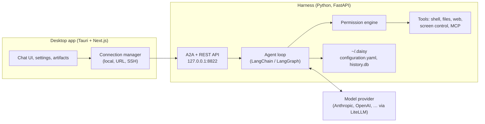

# Architecture

Daisy is split into a **harness** (the Python agent runtime, plus a server that exposes it) and an **app** (the native client). They communicate only over HTTP. The two can run on the same machine or on different ones, and nothing else changes.

## The harness

The `daisy` package is the agent runtime — an importable Python library you can drive directly. A thin FastAPI application wraps it for the network (`server.py` is a launch shim; both live in `src/daisy/`). Together they:

- serve **every agent** as an independently addressable [A2A](https://github.com/google/A2A) endpoint (JSON-RPC), plus a small REST API the UI uses;
- run the **agent loop** on LangChain / LangGraph, with model access through [LiteLLM](https://litellm.ai) so any provider looks the same;
- dispatch **tools** and run each one through the **permission engine** before it takes effect;
- persist everything to **`~/.daisy/`** — `configuration.yaml` and `history.db`.

It binds `127.0.0.1:8822` by default. It has **no built-in authentication**: it trusts whoever can reach the port. That is fine on `localhost`. Anywhere else, put auth and transport security in front yourself (see [Security notes](../SECURITY.md)).

## The app

A [Tauri](https://tauri.app) shell around a [Next.js](https://nextjs.org) UI (static export; Chakra UI). It is a **client** — it holds no agent logic. It renders conversations, manages settings, previews artifacts, and **chooses which harness to talk to**.

The packaged app bundles a frozen copy of the harness (built with PyInstaller by `packaging/build-sidecar.sh`) and starts it automatically, so a fresh install works with zero setup.

## Connections: local, remote, SSH

The UI's connection manager resolves the API base URL, in order:

1. a saved connection you selected in **Settings → Connections**, then
2. the build-time default `NEXT_PUBLIC_DAISY_API_BASE`, then
3. `http://localhost:8822`.

That yields three ways to run:

- **Local (default).** The app manages the bundled server on `127.0.0.1:8822`.
- **Remote URL.** Run `python server.py` on another host, expose `8822` (behind your own auth), and add its URL. The app becomes a native front-end to a remote backend — the agent's shell, files, and network all live on that host.
- **Over SSH.** Add an SSH host; Daisy forwards a local port to the remote `8822`, so the harness can live on a machine you only reach over SSH, with no exposed port.

Keeping the halves apart serves one goal: **put the compute, the files, and the credentials wherever they belong, and keep the interface native and local.**

## Request lifecycle (a message)

1. You send a message; the app POSTs it to the harness for the selected agent.
2. The agent loop calls the model, which may request tool calls.
3. Each tool call is classified for risk and checked against the permission mode. If it needs approval, the harness streams a permission request; the app shows the overlay and sends your decision back.
4. Approved tools run — shell in the sandbox, files on the active location, screen control (`search_screen`/`control_screen`) against the local machine, MCP against configured servers.
5. Results stream back as structured events; the app renders tool cards, artifacts, and the model's reply. Everything is persisted to `history.db`.

## Where to go next

- Configure providers and behavior: [Configuration guide](configuration.md).
- Author agents, skills, memory, and MCP servers: [Agents and skills guide](agents-and-skills.md).
- The tool surface in detail: [Tools guide](tools.md).
